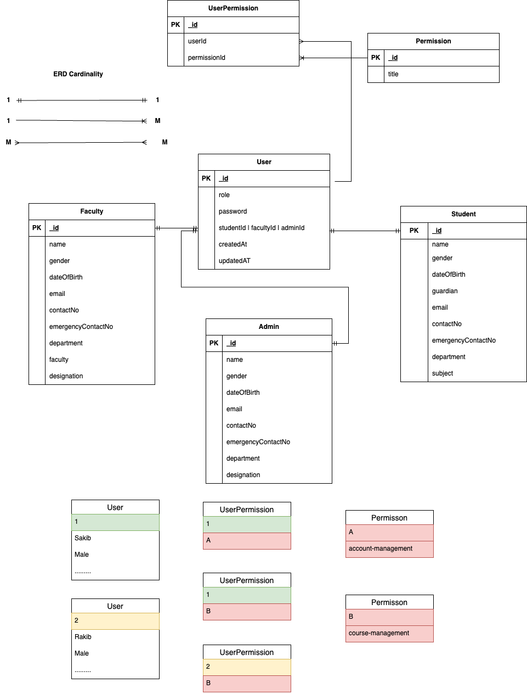

#   ` Authentication service`
---

We are building a university management system where we have three types of roles such as `Admin` , `Student` , `Faculty`.

##  1.  Functional Requirements:

###   ` Student`

- Student can login and log out
- Student can manage and update their profile.
- Student can update certain fields

- Student can enroll in a semester.
- Student can enroll in offered courses for a specific semester.
- Student can pay their tuition fees through offline or online.- (Partial / Full Payment)
- Student can see their transaction histories.
- Student can see their class routines.
- Student can see their notice board and events
- Student can see their results (Full / Semester Wise).
- Student can evaluate their teachers.

###    `Admin`
- Admin can log in and log out
- Admin can manage and update their profile.
- Admin can only update certain fields.
- **Admin can manage user accounts**
    - Block/Unblock
    - Change Password
    - Forcefully Log out
- **Admin can manage multiple process:**
    - Semester
    - Offered Courses
    - Section
    - Faculty
    - Student
    - Building
    - Room
    - Payment
    - Permissions
    - Activity

###   ` Faculty:`
- Faculty can log in and log out
- Faculty can manage and update their profile.
- Faculty can only update certain fields.
- Faculty can manage user accounts
- Faculty can manage student grades
- Access to Academic and Personal Information.
- Faculty can manage their lecture resources

---

##   2. Models

###  `  Models for students, admin, faculty`
---

####    `Common Properties`

#####  `Permission:`
- title

##### `UserPermission:`
- permissionId
- userId

#####    `User:`
* Id
* **role**
* Password
* createdAt
* updatedAt
* studentId || adminId || facultyId (This is referance field)

---

####    `1.Student:`

- id
- name
    - firstName
    - middleName
    - lastName
- gender
- dateOfBirth
- guardian
- contactNo
- emergencyContactNo
- email
- presentAddress
- permanentAddress
- department
-  Subject

####    `2.Admin:`
- Id
- name
    - firstName
    - middleName
    - lastName
- gender
- dateOfbirth
- email
- contactNo
- emergencyContactNo
- department
- designation

####   ` 3.Faculty:`

- Id
- name
    - firstName
    - middleName
    - lastName
- gender
- dateOfBirth
- Email
- contactNo
- emergencyContactNo
- department
- faculty
- Designation
---

##    3. API END POINTS:

**User:**
- users/create-student (POST)
- users/create-faculty (POST)
- users/create-admin (POST)
- users/my-profile (GET)
- users/:id (GET)
- users/:id (PATCH)
- user/:id (DELETE)
- users/:id/force-logged-out
- users?page=1&limit=10 (GET)
- users/:id/available-permissions?page=1&limit=10 (GET)
- users/:id/assigned-permissions?page=1&limit=10 (GET)
- users/:id/assign-permissions (POST)
- users/:id/remove-permissions (POST)

**Student:**

- students?page=1&limit=10 (GET)
- students/:id  (GET)
- students/:id    (PATCH)

**Faculty:**

- faculties?page=1&limit=10 (GET)
- faculties/:id  (GET)
- faculties/:id    (PATCH)

**Admin:**

- admins?page=1&limit=10 (GET)
- admins/:id  (GET)
- admin/:id    (PATCH)

**Permission**

- permissions?page=1&limit=10 (GET)
- permissions (POST)
- permissions/:id (GET)
- permissions/:id (PATCH)
- permissions/:id (DELETE)

**Auth**

- auth/login (POST)
- auth/refresh-token (POST)
- auth/change-password (POST)
- auth/forgot-password(POST)
- auth/reset-password (POST)

---

###    4. ER Diagram

